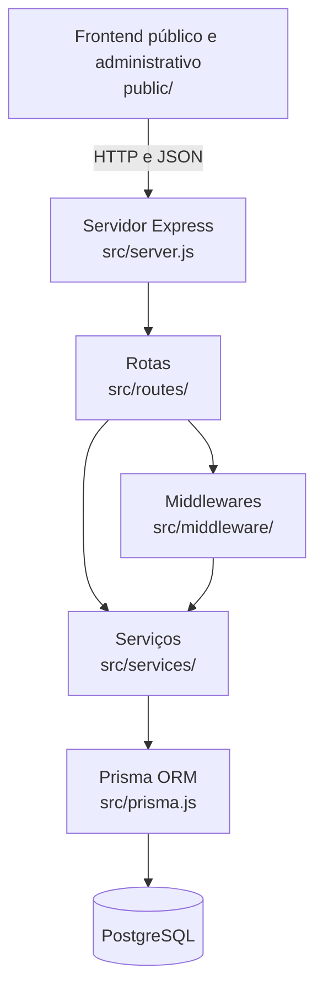
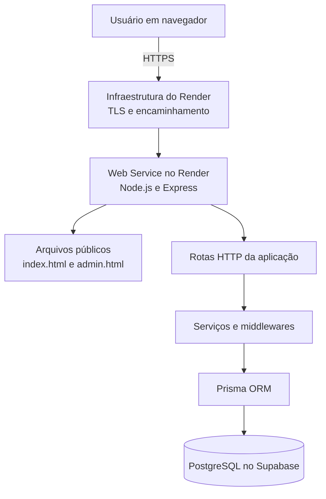

# Relatório de rastreabilidade dos requisitos no código-fonte

## 1. Identificação

**Projeto:** English Level Test  
**Repositório:** https://github.com/gianluca-berria/english-level-test  
**Aplicação publicada:** https://english-level-test.onrender.com  
**Área administrativa:** https://english-level-test.onrender.com/admin  

---

## 2. Requisitos acadêmicos

Os requisitos da atividade estão divididos em três unidades:

### Unidade 4 — Arquitetura de software

- arquitetura de software;
- solução escalável;
- padrão cliente-servidor;
- guia da arquitetura;
- diagrama arquitetural.

### Unidade 5 — Persistência de dados

- solução full stack;
- modelagem;
- ORM;
- CRUD funcional.

### Unidade 6 — Segurança em aplicações web

- SQL Injection;
- XSS;
- CSRF;
- HTTPS;
- relatório de vulnerabilidades.

---

# 3. Unidade 4 — Arquitetura de software

## 3.1 Padrão cliente-servidor

O padrão cliente-servidor encontra-se principalmente nos seguintes arquivos:

| Parte | Localização | Responsabilidade |
|---|---|---|
| Cliente público | `public/index.html`, `public/app.js`, `public/styles.css` | Exibir e controlar o teste |
| Cliente administrativo | `public/admin.html`, `public/admin.js`, `public/admin.css` | Exibir e controlar o painel administrativo |
| Servidor | `src/server.js` | Receber requisições HTTP, servir páginas e registrar APIs |
| API pública | `src/routes/alunos.js`, `src/routes/perguntas.js`, `src/routes/resultados.js` | Tratar o fluxo do aluno |
| API administrativa | `src/routes/admin.js`, `src/routes/adminAuth.js` | Tratar login e CRUD administrativo |

O frontend envia requisições HTTP para o Express. O navegador não acessa diretamente o PostgreSQL nos fluxos da aplicação.

Em `src/server.js`, o Express:

- serve os arquivos da pasta `public`;
- registra as rotas `/api/alunos`, `/api/perguntas` e `/api/resultados`;
- registra as rotas `/api/admin` e `/api/admin/auth`;
- disponibiliza a página administrativa em `/admin`;
- retorna erros internos com mensagem genérica.

## 3.2 Separação em camadas

| Camada | Arquivos | Função |
|---|---|---|
| Apresentação | `public/` | Interface do aluno e do administrador |
| Rotas | `src/routes/` | Entrada das requisições HTTP |
| Serviços | `src/services/` | Regras de negócio, autenticação, CPF, proficiência e exportação |
| Middlewares | `src/middleware/` | Autorização administrativa e verificação de origem |
| Persistência | `src/prisma.js`, `prisma/schema.prisma` | Comunicação e modelagem do banco |

A separação permite alterar uma regra de negócio sem reescrever toda a interface. Por exemplo, o cálculo do nível está isolado em `src/services/proficiency.js`.

## 3.3 Arquitetura lógica



## 3.4 Diagrama de implantação no Render

O diagrama abaixo representa a aplicação publicada, e não somente o ambiente local.



O Render hospeda o servidor Express. O mesmo Web Service entrega:

- `/` para o teste;
- `/admin` para o painel;
- `/api/...` para os endpoints.

Não há um serviço separado para a página administrativa.

## 3.5 Escalabilidade

A solução possui pontos favoráveis à evolução:

- camadas separadas;
- servidor sem estado permanente para a sessão administrativa;
- configuração por variáveis de ambiente;
- banco independente da instância do Render;
- frontend e API servidos pelo mesmo processo, simplificando a implantação.

---

# 4. Unidade 5 — Persistência de dados

## 4.1 Solução full stack

A solução é full stack porque reúne:

- interface web em `public/`;
- backend HTTP em `src/`;
- regras de negócio em `src/services/`;
- modelagem e acesso ao banco por Prisma;
- banco PostgreSQL.

## 4.2 Modelagem

A modelagem está em:

```text
prisma/schema.prisma
```

Modelos existentes:

| Modelo | Finalidade |
|---|---|
| `Aluno` | Armazenar nome, CPF e relação com resultados |
| `Categoria` | Organizar perguntas |
| `Pergunta` | Armazenar enunciado, categoria, estado e alternativas |
| `Alternativa` | Armazenar texto, pergunta e indicador de resposta correta |
| `Resultado` | Armazenar desempenho final do aluno |
| `Resposta` | Armazenar cada resposta e snapshots históricos |

Relações relevantes:

- uma categoria possui várias perguntas;
- uma pergunta possui várias alternativas;
- um aluno possui resultados;
- um resultado possui várias respostas;
- cada resposta referencia pergunta e alternativa.

O campo `cpf` é único em `Aluno`, e o CPF do resultado também possui restrição de unicidade.

## 4.3 ORM

O requisito de ORM é atendido pelo Prisma.

Arquivos principais:

```text
src/prisma.js
prisma/schema.prisma
```

Operações observadas no código:

```javascript
prisma.categoria.findMany()
prisma.categoria.create()
prisma.pergunta.update()
prisma.alternativa.delete()
prisma.resultado.findUnique()
prisma.$transaction()
```

Assim, os fluxos analisados usam métodos do Prisma em vez de montar comandos SQL pela concatenação de dados fornecidos pelo usuário.

## 4.4 CRUD funcional

As rotas do CRUD estão em:

```text
src/routes/admin.js
```

As regras e operações Prisma estão em:

```text
src/services/adminCatalog.js
```

### Categorias

| Operação | Método e rota |
|---|---|
| Create | `POST /api/admin/categorias` |
| Read | `GET /api/admin/categorias` |
| Update | `PUT /api/admin/categorias/:id` |
| Delete | `DELETE /api/admin/categorias/:id` |

### Perguntas

| Operação | Método e rota |
|---|---|
| Create | `POST /api/admin/perguntas` |
| Read | `GET /api/admin/perguntas` |
| Update | `PUT /api/admin/perguntas/:id` |
| Delete | `DELETE /api/admin/perguntas/:id` |

### Alternativas

| Operação | Método e rota |
|---|---|
| Create | `POST /api/admin/perguntas/:perguntaId/alternativas` |
| Read | `GET /api/admin/perguntas/:perguntaId/alternativas` |
| Update | `PUT /api/admin/alternativas/:id` |
| Delete | `DELETE /api/admin/alternativas/:id` |

A interface que consome essas rotas está em `public/admin.js`.

## 4.5 Integridade dos dados

`src/services/adminCatalog.js` contém regras para evitar inconsistências, como:

- texto obrigatório;
- identificador numérico válido;
- exatamente uma alternativa correta na criação da pergunta;
- bloqueio da exclusão de categoria com perguntas associadas;
- preservação de perguntas e alternativas já vinculadas a resultados;
- impedimento de remover a única alternativa correta sem substituí-la.

## 4.6 Persistência de resultados

A persistência do teste está em:

```text
src/routes/resultados.js
```

O backend:

1. valida nome e CPF;
2. impede nova tentativa para CPF já registrado;
3. carrega perguntas ativas e suas alternativas;
4. verifica se todas as perguntas foram respondidas;
5. confirma que cada alternativa pertence à pergunta indicada;
6. calcula desempenho no backend;
7. salva aluno, resultado e respostas.

O salvamento usa:

```javascript
prisma.$transaction()
```

Isso reduz o risco de salvar apenas uma parte da operação.

---

# 5. Unidade 6 — Segurança em aplicações web

## 5.1 SQL Injection

**Onde aparece a proteção:**

```text
src/prisma.js
prisma/schema.prisma
src/routes/resultados.js
src/services/adminCatalog.js
```

O acesso ao banco nos fluxos analisados ocorre por métodos do Prisma. Dados do usuário são enviados como valores de objetos, sem montagem manual de SQL por concatenação.

**Classificação:** mitigado nos fluxos atuais.

**Risco restante:** consultas SQL brutas adicionadas futuramente precisarão ser parametrizadas.

## 5.2 XSS

**Arquivos:**

```text
public/app.js
public/admin.js
src/server.js
```

Em `public/admin.js`, os elementos dinâmicos são construídos com `document.createElement()` e recebem texto por `textContent`. Não foi encontrado uso de `innerHTML` nesse arquivo.

Em `src/server.js`, o Helmet configura uma Content Security Policy que restringe scripts, estilos, imagens e conexões às origens definidas.

**Classificação:** mitigado.

## 5.3 CSRF

**Arquivos:**

```text
src/middleware/adminOrigin.js
src/services/adminAuth.js
src/routes/admin.js
```

Medidas encontradas:

- cookie administrativo com `SameSite=Strict`;
- cookie `HttpOnly`;
- verificação do cabeçalho `Origin` nas requisições administrativas que alteram dados;
- retorno HTTP 403 para origem externa ou inválida.

**Classificação:** parcialmente mitigado.

## 5.4 HTTPS

A aplicação publicada deve ser apresentada por:

```text
https://english-level-test.onrender.com
```

O HTTPS é encerrado e gerenciado pela infraestrutura do Render antes de a requisição alcançar o processo Express.

Em `src/services/adminAuth.js`, o cookie usa:

```javascript
secure: process.env.NODE_ENV === 'production'
```

Em produção, o navegador somente deve transmitir esse cookie por HTTPS.

**Classificação:** atendido na implantação.

## 5.5 Autenticação administrativa

**Arquivos:**

```text
src/routes/adminAuth.js
src/services/adminAuth.js
src/middleware/adminAuth.js
```

As credenciais são lidas de:

```env
ADMIN_USERNAME
ADMIN_PASSWORD
ADMIN_SESSION_SECRET
```

Medidas encontradas:

- credenciais não são embutidas no frontend;
- comparação resistente a diferença de tempo com `crypto.timingSafeEqual`;
- sessão assinada com HMAC SHA-256;
- token contém data de expiração e valor aleatório;
- rotas administrativas exigem sessão válida;
- cookie `HttpOnly`, `SameSite=Strict` e `Secure` em produção;
- limite simples de tentativas de login por IP.

A duração atual está fixa em oito horas em `src/services/adminAuth.js`. Há uma melhoria planejada para reduzi-la e torná-la configurável.

## 5.6 Validação de entradas

**Arquivos:**

```text
src/services/cpf.js
src/services/adminCatalog.js
src/routes/resultados.js
```

São validados:

- nome do aluno;
- formato e dígitos verificadores do CPF;
- repetição de CPF;
- número de respostas;
- vínculo entre pergunta e alternativa;
- textos administrativos obrigatórios;
- identificadores numéricos;
- quantidade de alternativas corretas.

## 5.7 Proteção da resposta correta

**Arquivo:**

```text
src/routes/perguntas.js
```

A rota pública seleciona para as alternativas somente os campos necessários ao aluno. O indicador `correta` não é entregue pelo endpoint público.

A correção acontece em `src/routes/resultados.js`, no backend.

## 5.8 Tratamento de erros

**Arquivo:**

```text
src/server.js
```

O middleware final devolve:

```json
{
  "message": "Erro interno do servidor."
}
```

O stack trace é registrado no servidor, mas não é devolvido ao navegador.

---

# 6. Relatório resumido de vulnerabilidades

| Ameaça | Medida encontrada | Situação | Melhoria possível |
|---|---|---|---|
| SQL Injection | Prisma ORM | Mitigada | Manter consultas brutas parametrizadas |
| XSS | `textContent` e CSP do Helmet | Mitigada | Evitar `innerHTML` com dados externos |
| CSRF | `SameSite=Strict` e validação de origem | Parcialmente mitigada | Adicionar token CSRF |
| Interceptação | HTTPS do Render e cookie `Secure` | Atendida na implantação | Garantir `NODE_ENV=production` |
| Força bruta | Limite por IP em memória | Parcialmente mitigada | Usar armazenamento compartilhado |
| Adulteração de sessão | Assinatura HMAC | Mitigada | Proteger e rotacionar o segredo |
| Exposição da resposta | Campo `correta` omitido da API pública | Mitigada | Manter as rotas administrativas protegidas |
| Erros internos | Mensagem genérica ao cliente | Mitigada | Proteger o acesso aos logs |
| Sessão abandonada | Expiração em oito horas | Melhorável | Reduzir e tornar configurável |

---

# 7. Matriz final de rastreabilidade

| Requisito | Implementação encontrada |
|---|---|
| Arquitetura cliente-servidor | `public/`, `src/server.js` e `src/routes/` |
| Separação em camadas | `public/`, `src/routes/`, `src/services/`, `src/middleware/` e `src/prisma.js` |
| Diagrama arquitetural | Diagramas lógico e de implantação neste documento |
| Solução escalável | Separação por responsabilidades e configuração por ambiente |
| Solução full stack | Frontend, backend, ORM e PostgreSQL |
| Modelagem | `prisma/schema.prisma` |
| ORM | Prisma em `src/prisma.js` |
| CRUD funcional | `src/routes/admin.js` e `src/services/adminCatalog.js` |
| Persistência de resultados | `src/routes/resultados.js` |
| SQL Injection | Acesso ao banco por Prisma |
| XSS | `textContent` em frontend e CSP em `src/server.js` |
| CSRF | `src/middleware/adminOrigin.js` e cookie `SameSite=Strict` |
| HTTPS | Render e cookie `Secure` em produção |
| Autenticação | `src/routes/adminAuth.js`, `src/services/adminAuth.js` e `src/middleware/adminAuth.js` |
| Relatório de vulnerabilidades | Seção 6 |
| Implantação real | Render → Web Service Express → Prisma → PostgreSQL/Supabase |

---

# 8. Conclusão

O projeto atende aos requisitos centrais de arquitetura cliente-servidor, solução full stack, modelagem relacional, ORM, CRUD funcional e segurança web básica.

A arquitetura publicada é composta pelo navegador do usuário, pela infraestrutura HTTPS do Render, pelo Web Service Node.js/Express, pelo Prisma ORM e pelo PostgreSQL hospedado no Supabase.

Node.js deve ser apresentado como tecnologia escolhida para o backend, e não como requisito da disciplina.

As principais melhorias pendentes são o fortalecimento da proteção CSRF, a redução do tempo da sessão administrativa, a persistência distribuída do limite de login e o tratamento dos alertas de RLS no Supabase.
